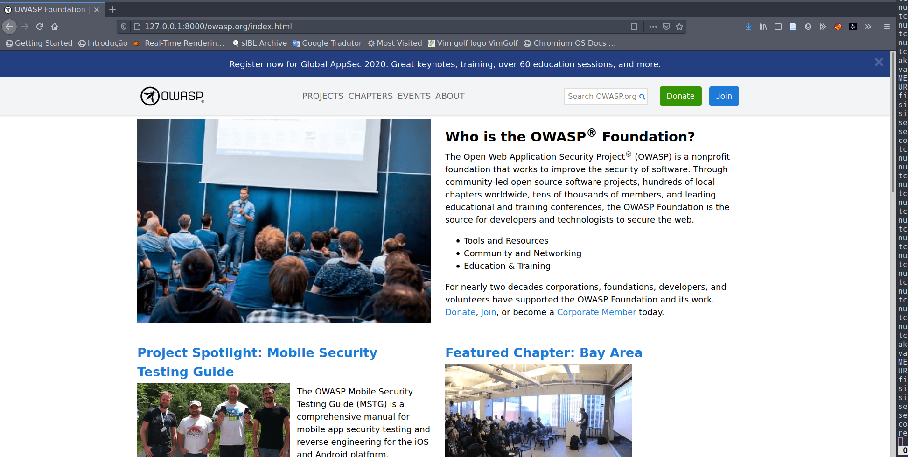
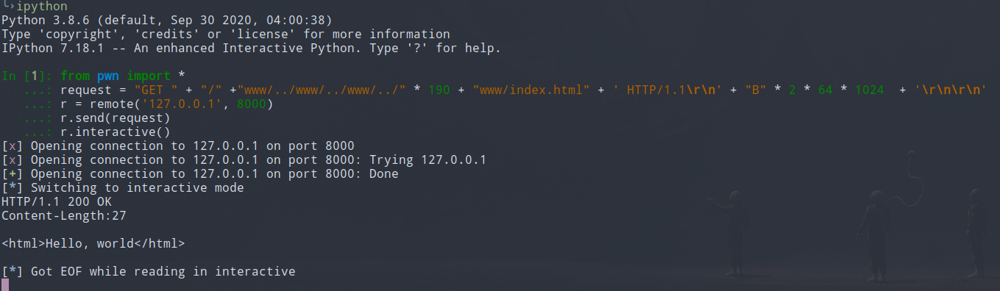
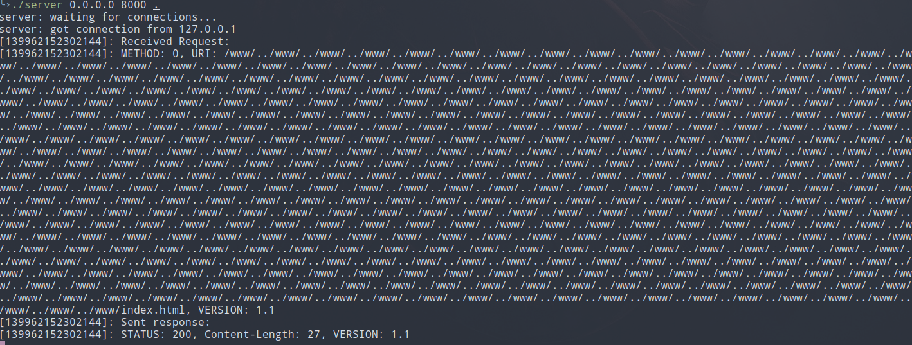
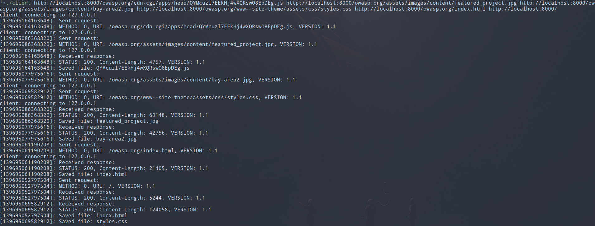
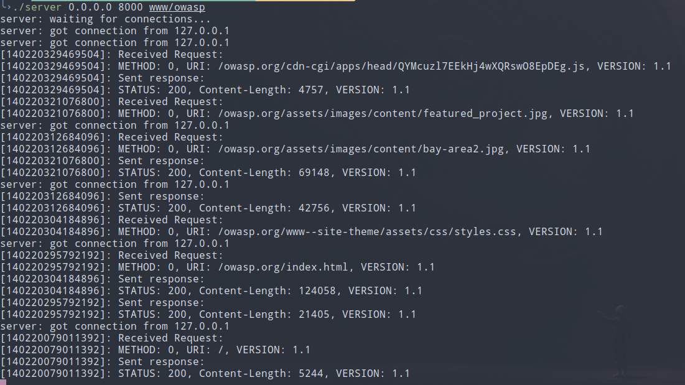

# Lab-Cliente-Servidor-HTTP
Laboratório: Implementando Cliente e Servidor HTTP

## Prerequisites
- premake5 (optional) pre generated make files are in build folder so you don't necessarily need generate them
- [Python pwntools](https://github.com/Gallopsled/pwntools) (optional) only to complex tests

## Installation


```bash
premake5 --file=scripts/premake5.lua gmake2
make -C build/ config=debug_linux64 
```

This will create link to executables in project main folder, so you doesn't have to cd
in build directory

# Basic Usage

Create desired files inside desired folder, in examples was used www/ folder

### Server

Create files to be served on desired folder e run server, use CTRL-C to terminate program.

```bash
cd build/bin/Linux64/Debug
./server 0.0.0.0 8000 www
```

### Client

```bash
telnet 127.0.0.1 3490
GET /www/index.html HTTP/1.1\r\n\r\n
```
or

```bash
./client http://localhost:8000/index.html http://localhost:8000/index2.html
```


## Additional tests
[OWASP](www.owasp.org) site was clone using httrack tool with depht value equal 2, and was saved on www/owasp folder

### OWASP cloned site

Alternatively you can use the links to executables that premake5 create on main folder.

```bash
./server 0.0.0.0 8000 www/owasp
```

Use browser to test served cloned site.


### Pwntools big request
Neither recv() nor send() garantees that all bytes will be processed in one call, as we can't know in which
case this occurs, we need force this behavior for test purposes.
Create a index.html inside www folder, we will be using pwntools for this test, 
file path max size in Linux systems is 4096 bytes, max tcp size is 64Kb(64 * 1024), this way we know that 
we will need more then one recv() call to reach a CRLF.

```bash
echo "<html>Hello, world</html>\n" > www/index.html
./server 0.0.0.0 8000 .
```
In another terminal run:

```bash
ipython
from pwn import *
request = "GET " + "/" +"www/../www/../www/../" * 190 + "www/index.html" + ' HTTP/1.1\r\n' + "B" * 2 * 64 * 1024  + '\r\n\r\n'
r = remote('127.0.0.1', 8000)
r.send(request)
r.interactive()
```



### Multiple parallel requests
Client sends requests in parallel, so we could check the behavior from both server and client side.

Run server from main project directory:
```bash
./server 0.0.0.0 8000 www/owasp/
````

```bash
./client http://localhost:8000/owasp.org/cdn-cgi/apps/head/QYMcuzl7EEkHj4wXQRswO8EpDEg.js http://localhost:8000/owasp.org/assets/images/content/featured_project.jpg http://localhost:8000/owasp.org/assets/images/content/bay-area2.jpg http://localhost:8000/owasp.org/www--site-theme/assets/css/styles.css http://localhost:8000/owasp.org/index.html http://localhost:8000/
```




**P.S: You can use `git clean -f -x` to clean main directory**

## License
[MIT](https://choosealicense.com/licenses/mit/)
